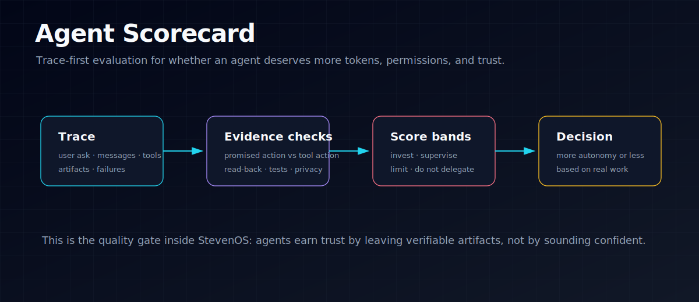

# Agent Scorecard

<p align="center">
  
</p>

A small, trace-first evaluation harness for answering one practical question:

> Is this agent worth Steven investing more tokens, permissions, and attention in?

This is not a generic LLM benchmark. It scores agent work against Steven-specific operating standards: useful artifacts, tool discipline, verification, concise communication, memory/logging, and avoidance of performative busywork.

## Part of StevenOS

`agent-scorecard` is the **evaluation layer** in Steven's Personal AI Operating System.

- **Upstream:** Hermes / OpenClaw / Codex-style traces from real agent work.
- **This layer:** deterministic checks for tool discipline, verification, artifact creation, and concise handoff quality.
- **Downstream:** autonomy decisions — which agents deserve more tokens, permissions, and attention.
- **Proof:** Markdown reports that explain what passed, what failed, and why the task should or should not be delegated again.

## MVP scope

- Define a transparent scoring standard in `docs/scorecard-standard.md`.
- Evaluate simple JSONL traces with rule-based checks.
- Produce Markdown reports that explain verdicts and failures.
- Compare Hermes/OpenClaw/Codex-style agents on the same work patterns.

## Quick start

```bash
PYTHONPATH=src python -m agent_scorecard.cli examples/traces/good_obsidian_task.jsonl
PYTHONPATH=src python -m agent_scorecard.cli examples/traces/bad_busywork_task.jsonl --format markdown
```

Or install locally first:

```bash
python -m pip install -e .
agent-scorecard examples/traces/good_obsidian_task.jsonl
```

## Score bands

- `85-100`: invest more — reliable enough for higher autonomy.
- `70-84`: usable with supervision — good but needs targeted improvement.
- `50-69`: limited trust — useful for narrow tasks only.
- `<50`: do not delegate — too much review burden.

## Trace format

JSONL, one event per line:

```json
{"type":"user","text":"research this and write the result to Obsidian"}
{"type":"assistant","text":"I will check sources and write the note."}
{"type":"tool_call","tool":"browser_navigate"}
{"type":"tool_call","tool":"write_file","path":"/vault/wiki/outputs/report.md"}
{"type":"tool_call","tool":"read_file","path":"/vault/wiki/outputs/report.md"}
{"type":"assistant","text":"Done: wrote /vault/wiki/outputs/report.md and verified it."}
```

## What evidence is needed?

See `docs/evaluation-inputs.md`.

Short version: the scorer needs real traces with user ask, assistant messages, tool calls, artifacts, verification events, and failures. The next valuable improvement is trace collection from Hermes/OpenClaw runs, not adding more evaluator complexity.

## Repository status

This is a v0 local repo. The first goal is a useful internal standard, not a polished platform.
